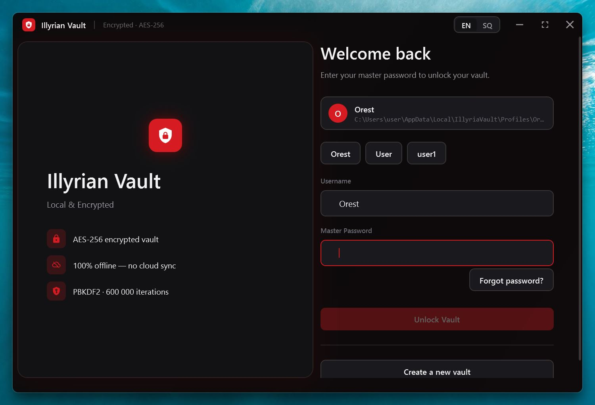
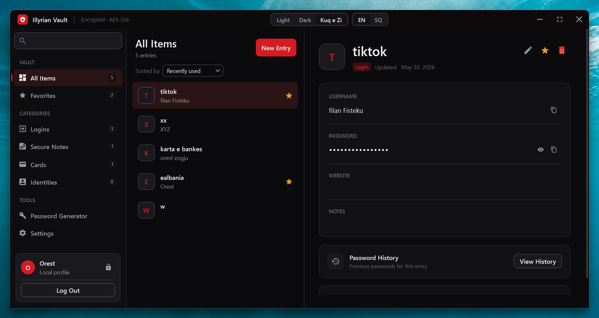
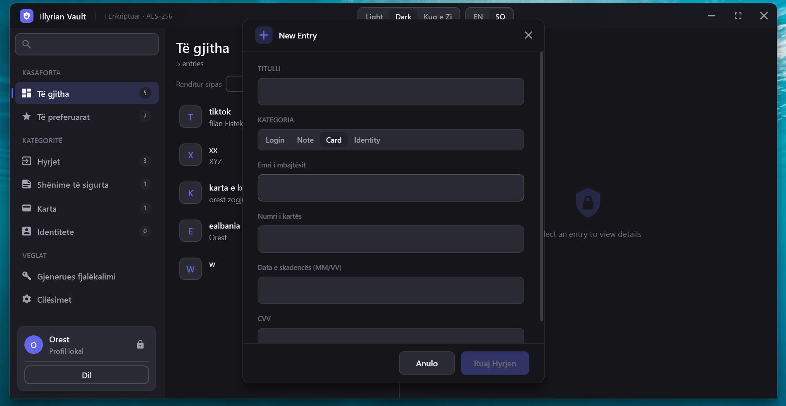
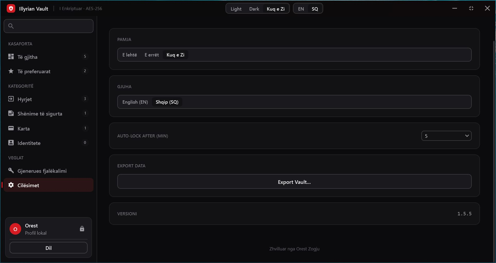
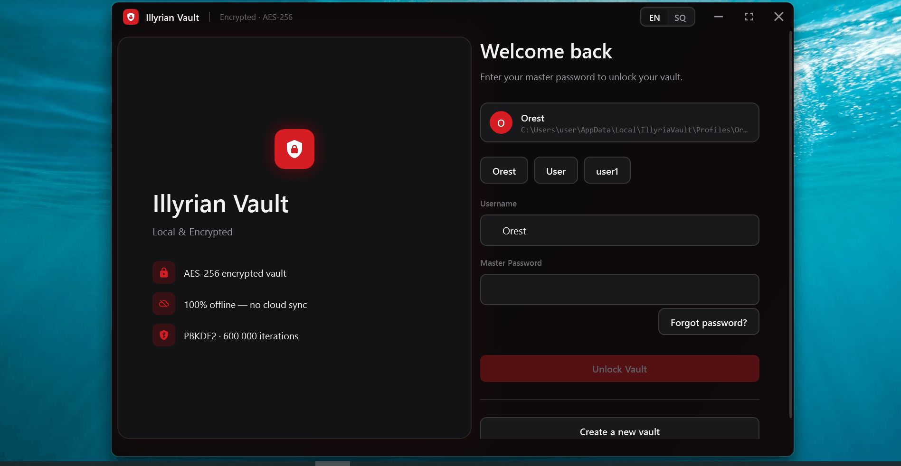

<div align="center">

# 🔐 Illyrian Vault

**A local, offline, fully encrypted password manager for Windows.**

No cloud. No accounts. No tracking. Your data never leaves your machine.


</div>

---

## Download & Install

> **First time here? Always download the ZIP — not the bare `.exe`.**
> The ZIP contains the app, the auto-updater, the README, and the license.
> The standalone `Illyrian.Vault.exe` asset is only used by the updater internally.

### New Users

1. Go to the [latest release](../../releases/latest)
2. Download **`IllyrianVault-v1.5.5-win-x64.zip`**
3. Extract the folder anywhere you like — Desktop, Documents, a USB drive
4. Run **`Illyrian Vault.exe`**
5. Click **Create a Vault**, set your master password, and save your Recovery Key

No installation, no admin rights, no .NET required.

### Existing Users — Update

Run **`Updater.exe`** (included in the ZIP you originally downloaded).
It will check GitHub for the latest version, download it, swap the exe, and relaunch automatically.

---

## Screenshots

<table>
  <tr>
    <td align="center" width="50%">
      
      <br/>
      <sub><b>Login Screen</b> — Multi-profile selector, master password entry, and key security specs shown at a glance.</sub>
    </td>
    <td align="center" width="50%">
      
      <br/>
      <sub><b>Vault Dashboard</b> — Full entry list with category sidebar, search, sort, and a detailed entry panel with password history.</sub>
    </td>
  </tr>
  <tr>
    <td align="center" width="50%">
      
      <br/>
      <sub><b>New Entry Dialog</b> — Add Logins, Secure Notes, Cards, or Identities. Shown here in Albanian (Shqip) with the Card form.</sub>
    </td>
    <td align="center" width="50%">
      
      <br/>
      <sub><b>Settings Panel</b> — Switch themes (Light / Dark / Kuq e Zi), change language, configure auto-lock timeout, and export your vault.</sub>
    </td>
  </tr>
</table>

---

## Demo

<div align="center">
  
  <br/>
  <sub>Full walkthrough — login, adding entries, password generator, clipboard guard, theme switching, and auto-lock.</sub>
</div>

---

## What is Illyrian Vault?

Illyrian Vault is a free, portable password manager built for Windows. Everything is stored locally in a fully encrypted database — there is no server, no sync service, and no internet requirement. The master password never leaves your device.

Built with a security-first design and a clean, modern UI.

---

## Features

- **AES-256-GCM** field-level encryption on every password entry
- **SQLCipher** full-database encryption — the `.db` file is unreadable without your master password
- **PBKDF2-SHA512** key derivation at 600,000 iterations (OWASP 2023 standard)
- **Multiple entry types** — Logins, Credit Cards, Secure Notes, Identities
- **Password Generator** with configurable length, character sets, and live strength scoring
- **HaveIBeenPwned** breach check via k-anonymity — your password is never sent over the wire
- **Password History** — every changed password is archived and viewable per entry
- **Idle auto-lock** — vault locks automatically after configurable inactivity timeout
- **Clipboard guard** — copied passwords are auto-wiped from the clipboard after 15 seconds
- **Recovery Key** — 128-bit random key lets you reset your master password without losing data
- **Multi-profile support** — multiple local vaults on one machine, each fully isolated
- **Export** — encrypted JSON backup or plain-text CSV (with explicit warning)
- **Themes** — Red (Kuq e Zi), Dark, and Light
- **Bilingual** — English and Albanian (Shqip)
- **Portable** — single `.exe`, no installer, no registry entries

---

## Security Architecture

| Layer | Implementation |
|---|---|
| Master key derivation | PBKDF2-SHA512, 600,000 iterations, 256-bit salt |
| Database encryption | SQLCipher AES-256-CBC, HMAC-SHA512 page authentication |
| Field encryption | AES-256-GCM, fresh 96-bit nonce per value |
| Password verification | SHA-256(derivedKey ‖ "ILLYRIA_VERIFY"), fixed-time compare |
| Recovery key wrapping | PBKDF2-SHA512 → AES-256-GCM wrapped master key |
| Brute-force protection | Exponential backoff + 5-minute hard lockout after 10 failures |
| Memory safety | Pinned byte arrays, `CryptographicOperations.ZeroMemory` on dispose |
| Clipboard | SHA-256 ownership hash, auto-wipe after 15 seconds |
| Breach check | HIBP k-anonymity — only 5-char SHA-1 prefix sent, never the password |

The master password is extracted from WPF's `SecureString` via `Marshal.SecureStringToBSTR` directly into a pinned UTF-8 buffer. It is never materialized as a managed `System.String`.

---

## Requirements

- Windows 10 or Windows 11 (x64)
- No .NET installation required — the runtime is bundled inside the executable

---

## Getting Started

1. Download `Illyrian Vault.exe` from the [Releases](../../releases) page
2. Run it — no installation needed
3. Click **Create a Vault** and choose a strong master password
4. **Save your Recovery Key** in a safe, offline location — printed or on a USB drive
5. Start adding entries

> Your vault is stored at `%LOCALAPPDATA%\IllyriaVault\Profiles\<username>\vault.db`
>
> Back it up by copying that folder to an external drive. The file is encrypted — it is safe to store on any medium.

---

## Building from Source

```powershell
git clone https://github.com/Orest-Z/Illyria-Vault.git
cd Illyria-Vault
dotnet publish -c Release -r win-x64 --self-contained true `
    -p:PublishSingleFile=true `
    -p:IncludeNativeLibrariesForSelfExtract=true `
    -p:AssemblyName="Illyrian Vault" `
    -o ./publish
```

Requires the [.NET 10 SDK](https://dotnet.microsoft.com/download).

---

## Uninstalling

Illyrian Vault writes nothing to the Windows Registry. To remove it completely:

1. Delete `Illyrian Vault.exe`
2. Delete `%LOCALAPPDATA%\IllyriaVault\` *(back up your vault first if you want to keep your data)*

---

## Tech Stack

| Package | Purpose |
|---|---|
| .NET 10 WPF | UI framework |
| CommunityToolkit.Mvvm 8.4 | MVVM source generators |
| Microsoft.Data.Sqlite.Core | SQLite ADO.NET driver |
| SQLitePCLRaw.bundle_e_sqlcipher | SQLCipher AES-256 encryption |
| MahApps.Metro.IconPacks.Material | Material Design icons |

---

## License & Copyright

Copyright (c) 2026 **Orest Zogju**. All Rights Reserved.

The name **"Illyrian Vault"** and its associated branding are the exclusive intellectual property of Orest Zogju and may not be used in any derivative or competing product.

This project is **source available** — you may view and run it for personal, non-commercial use. You may **not** redistribute, resell, sublicense, or publish modified versions without written permission from the author. See the [LICENSE](LICENSE) file for full terms.

---

## Author

**Orest Zogju**
📧 orestzogju@gmail.com

---

<div align="center">
  <i>"Your secrets, encrypted with iron — stored only on your machine."</i>
</div>

